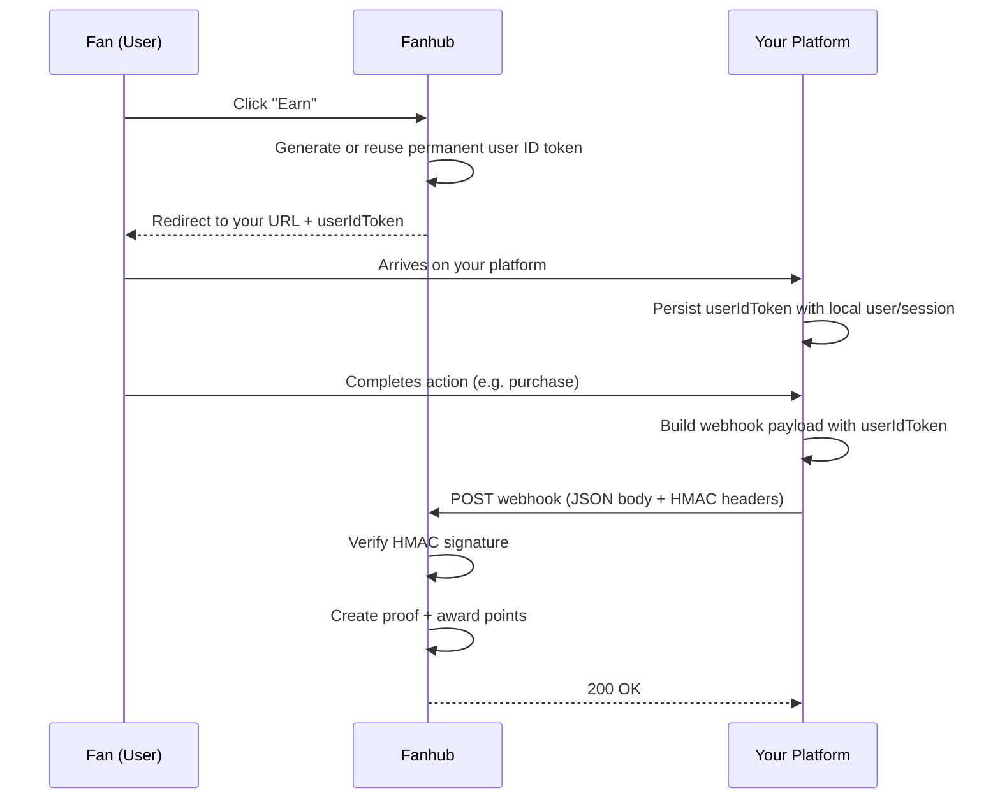
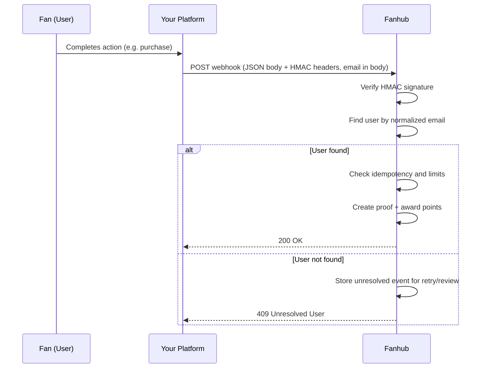

# Fanhub External Actions - Integration Guide

## Overview

External Actions let your users earn points on Fanhub by completing actions on your platform, such as purchases, account activations, or game sessions.

The integration works as follows:

1. A Fanhub user clicks an "Earn" button that redirects them to your platform with a user identification token.
2. The user completes an action on your platform (e.g. makes a purchase).
3. Your backend sends a signed webhook to Fanhub reporting the completion.
4. Fanhub verifies the webhook, resolves the user, and awards points.

## Getting Started

### Credentials

During onboarding you will receive:

| Credential     | Description                                                                                                    |
| -------------- | -------------------------------------------------------------------------------------------------------------- |
| `partnerId`    | Your opaque partner UUID (matches `external_partner.id`). Used in webhook headers and URL paths.               |
| `sharedSecret` | A secret key used to sign webhook payloads with HMAC-SHA256. Keep this secure and never expose it client-side. |

### Action Configuration

Each earning opportunity is configured as an **action** on the Fanhub side. For each action you integrate, you will receive:

| Value              | Description                                                                                                                                                                                                           |
| ------------------ | --------------------------------------------------------------------------------------------------------------------------------------------------------------------------------------------------------------------- |
| `partnerActionKey` | A human-readable key that identifies the specific earning opportunity (e.g. `purchase_completed`, `game_beaten`, `account_linked`). Include this in every webhook payload so Fanhub knows which action was completed. |

The `partnerActionKey` describes the completed event itself. It is shared with you through a back channel such as onboarding docs, email, or Discord and must not be passed through user redirect URLs.

### Checklist

1. Store your `partnerId`, `sharedSecret`, and `partnerActionKey`(s) securely in your backend.
2. Implement the user redirect capture (store the `userIdToken` query parameter when users arrive from Fanhub).
3. Implement webhook signing and dispatch from your backend.
4. Test using the [reference implementation](#reference-implementation) to verify your signing logic matches.

---

## Account Linking

Fanhub supports two methods for identifying which user completed an action. Both methods are described below.

### Method 1: User ID Token (Recommended)

This is the default and preferred linking strategy. Only users who actually clicked out from Fanhub can be rewarded, and the token can permanently identify the user without requiring repeated relinking.

**How it works:**

1. The user clicks "Earn" on Fanhub.
2. Fanhub generates (or reuses) a permanent opaque user ID token.
3. The user is redirected to your platform with the token appended as a query parameter:

```text
https://your-platform.example.com/landing-page?userIdToken=<opaque-token>
```

4. Your platform stores the `userIdToken` alongside your local user.
5. When the user completes an action, your backend includes the `userIdToken` in the webhook payload.

**Important notes:**

- Treat the token as fully opaque. Do not attempt to parse or decode it.
- The token is permanent by design and does not expire.
- The same token can be reused across multiple actions for the same partner.
- You should persist the token so future completions by the same user can reference it without requiring a new redirect.



### Method 2: Email Matching (Fallback)

Use email matching only when your platform cannot reliably persist the user ID token from the redirect flow.

**How it works:**

1. The user completes an action on your platform.
2. Your backend sends a webhook with the user's email address instead of a `userIdToken`.
3. Fanhub looks up the user by normalized email.

**Trade-offs:**

- Easier for partners to implement since no redirect capture is needed.
- Weaker than token linking because it does not prove the user clicked out from Fanhub.
- Can fail when email addresses differ between platforms.



---

## Webhook Contract

### Endpoint

```text
POST {baseUrl}/external-actions/webhooks/:partnerId
```

`{baseUrl}` is the environment base URL we provide. It already includes the `/api` prefix and is the same value used as `url` in the runnable demo configuration. For development that is `https://dev.incention.io/api`, so the full endpoint is:

```text
POST https://dev.incention.io/api/external-actions/webhooks/:partnerId
```

Replace `:partnerId` with your assigned partner UUID (e.g. `a1b2c3d4-e5f6-4789-a012-3456789abcde`). Keep the `/api` prefix; without it the request does not reach the API.

### Headers

Every webhook request must include the following headers:

| Header                  | Description                                                         |
| ----------------------- | ------------------------------------------------------------------- |
| `x-partner-id`          | Your partner UUID (must match the `:partnerId` URL param)           |
| `x-signature-timestamp` | Unix epoch timestamp in milliseconds when the signature was created |
| `x-signature`           | HMAC-SHA256 signature in the format `sha256=<hex-digest>`           |

### Body

The request body must be a JSON object with the following shape:

```typescript
type WebhookBody = {
  partnerActionKey: string; // The action key provided during onboarding
  partnerEventId: string; // Your unique event identifier (idempotency key)
  occurredAt: string; // ISO 8601 timestamp of when the event happened
  userIdToken?: string | null; // The opaque user ID token from the redirect (omit or send null for email linking)
  email?: string | null; // User email for email-based linking (omit or send null for token linking)
  partnerUserId?: string | null; // Your internal user ID, for auditing purposes (omit or send null when unavailable)
  amount?: string | null; // Decimal string (e.g. "50.00"), required for amount-based rewards
  metadata: Record<string, string>; // Arbitrary key-value pairs for context
};
```

For every nullable webhook field, `null` and omission are treated the same. Prefer omission when the field has no value so the payload stays smaller.

**Example body (user ID token linking):**

```json
{
  "partnerActionKey": "purchase_completed",
  "partnerEventId": "purchase_12345",
  "occurredAt": "2026-04-15T14:00:00.000Z",
  "userIdToken": "uidtok_demo_user_123",
  "partnerUserId": "user_9981",
  "amount": "50.00",
  "metadata": {
    "orderId": "ord_12345",
    "sku": "john-wick-claw-pull"
  }
}
```

**Example body (email linking):**

```json
{
  "partnerActionKey": "game_beaten",
  "partnerEventId": "game_beat_123",
  "occurredAt": "2026-04-15T14:00:00.000Z",
  "email": "fan@example.com",
  "partnerUserId": "user_9981",
  "metadata": {
    "gameId": "game_123"
  }
}
```

**Field details:**

| Field              | Required    | Description                                                                                                                                                        |
| ------------------ | ----------- | ------------------------------------------------------------------------------------------------------------------------------------------------------------------ |
| `partnerActionKey` | Yes         | The action key provided during onboarding (e.g. `purchase_completed`, `game_beaten`).                                                                              |
| `partnerEventId`   | Yes         | A unique identifier for this event on your side. This is the primary idempotency key — sending the same `partnerEventId` twice will not create a duplicate reward. |
| `occurredAt`       | Yes         | ISO 8601 timestamp of when the action occurred on your platform.                                                                                                   |
| `userIdToken`      | Conditional | The opaque token received during the user redirect. Required for token-based linking. Omit it or send `null` for email linking.                                    |
| `email`            | Conditional | The user's email address. Required for email-based linking. Omit it or send `null` for token linking.                                                              |
| `partnerUserId`    | No          | Your platform's internal user identifier. Optional, used for auditing and debugging. Omit it or send `null` when unavailable.                                      |
| `amount`           | Conditional | Decimal string (e.g. `"50.00"`). Required when the action uses amount-based payout. Omit it or send `null` for flat-rate actions.                                  |
| `metadata`         | Yes         | Free-form key-value pairs. All values must be strings. Use this for order IDs, SKUs, game IDs, or any context useful for auditing.                                 |

---

## HMAC Signature

All webhook requests must be signed using HMAC-SHA256 with the `sharedSecret` provided during onboarding.

### Signing Steps

1. **Capture the raw body.** Serialize your webhook body to a JSON string. This exact string is what gets signed — do not re-serialize or reformat it after signing.

2. **Get the current timestamp.** Use the current Unix epoch in milliseconds (e.g. `1776261600000`).

3. **Build the signing input.** Concatenate the timestamp and the raw body with a period separator:

```text
${timestamp}.${rawBody}
```

4. **Compute the HMAC.** Sign the input using HMAC-SHA256 with your `sharedSecret`:

```text
HMAC-SHA256(sharedSecret, signingInput)
```

5. **Format the signature header.** Prefix the hex digest with `sha256=`:

```text
sha256=<hex-digest>
```

### Example

See [`runnables/generate-webhook-payload.ts`](./runnables/generate-webhook-payload.ts) for a complete Node.js reference implementation of payload generation and HMAC signing.

### Verification Rules

Fanhub will reject the webhook if any of the following is true:

- Required signature headers are missing.
- The HMAC signature does not match the raw body.
- The signature timestamp is outside the allowed age window (to prevent replay attacks).
- The `partnerEventId` has already been processed (idempotency).
- The `partnerActionKey` cannot be resolved to a configured action.
- The user cannot be resolved from the provided token or email.

---

## Reward Modes

How points are calculated depends on how the action is configured on the Fanhub side. You do not need to compute points yourself — just send the correct `amount` when applicable.

### Flat Rate

A fixed number of points is awarded per completion regardless of amount.

- **Your responsibility:** Omit `amount` entirely for flat-rate actions. Sending `null` is also accepted and treated the same way.
- **Example:** Action configured for 25 points per completion → user earns 25 points.

### Per Amount

Points scale with a numeric amount you provide.

- **Your responsibility:** Send the `amount` field as a decimal string (e.g. `"50.00"`).
- **Example:** Action configured for 2 points per 1 USD, you send `amount = "50.00"` → user earns 100 points.

---

## Completion Limits

Actions can be configured with completion limits on the Fanhub side. Limits are enforced per user and based on the number of completed events (not the amount value).

| Limit Type | Behavior                               |
| ---------- | -------------------------------------- |
| Unlimited  | No cap on completions.                 |
| Daily      | Resets at midnight UTC each day.       |
| Total      | Lifetime cap per user for this action. |

If a user has reached their limit, the webhook will be accepted but no additional points will be awarded.

---

## Response Codes

| Status | Meaning                                                                                          |
| ------ | ------------------------------------------------------------------------------------------------ |
| `200`  | Webhook accepted and processed. Points awarded (or event was a duplicate and already processed). |
| `400`  | Bad request. Missing or malformed headers, body, or signature.                                   |
| `401`  | Unauthorized. Invalid HMAC signature or unknown partner.                                         |
| `422`  | Unprocessable entity. Body of the response will detail what went wrong                           |

---

## Reference Implementation

The `runnables/` directory contains a TypeScript reference implementation for generating and validating HMAC-signed webhook payloads. Use this to verify your signing logic matches the expected contract.

### Prerequisites

- Node.js 24+
- [pnpm](https://pnpm.io/)

### Setup

```bash
cd runnables
pnpm install
```

### Available Scripts

| Command         | Description                                                          |
| --------------- | -------------------------------------------------------------------- |
| `pnpm generate` | Generate a demo signed webhook payload and print it to stdout.       |
| `pnpm validate` | Validate a generated payload against the shared secret.              |
| `pnpm demo`     | Run the full end-to-end demo: generate, validate, and tamper-detect. |

### Key Files

| File                          | Purpose                                                                                                                                   |
| ----------------------------- | ----------------------------------------------------------------------------------------------------------------------------------------- |
| `generate-webhook-payload.ts` | Creates a demo webhook body and computes the HMAC signature. Exports the `createWebhookSignature` and `generateWebhookPayload` functions. |
| `validate-webhook-payload.ts` | Verifies the HMAC signature against the raw body and parses the webhook payload. Exports the `validateWebhookPayload` function.           |
| `generations-validation.ts`   | Runs the happy-path validation and tamper-detection scenarios end to end.                                                                 |

### Quick Verification

Run the full demo to confirm signing and validation work end to end:

```bash
pnpm demo
```

Expected output:

1. A signed payload is generated.
2. The payload is validated successfully.
3. A tampered payload (modified amount) is rejected.
4. A payload signed with a wrong key is rejected.

If all checks pass, your environment is set up correctly and you can use the signing logic as a reference for your own implementation.
